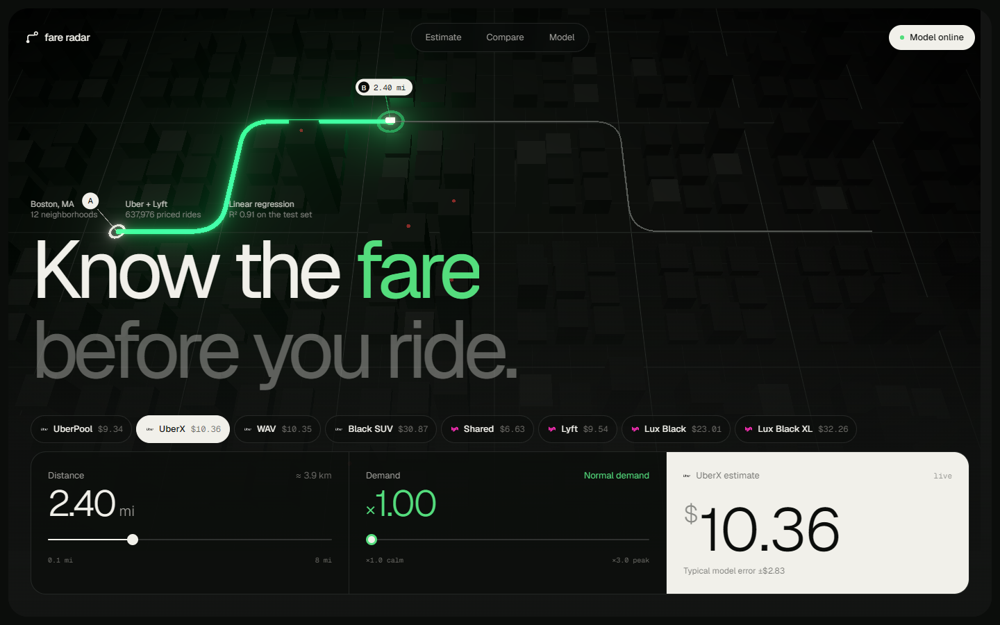

<p align="center">
  
  
  
  
  
</p>

# fare radar — Uber & Lyft price prediction

**fare radar** estimates what an Uber or Lyft ride in Boston will cost before you book it. Pick a ride type, set the distance and surge multiplier, and a linear regression model trained on 637,976 real priced rides returns the fare instantly.

## Quick start

You need Python 3.10+ and Node.js 18+.

**1. Backend (FastAPI)**

```bash
python -m venv .venv
.venv\Scripts\activate          # macOS/Linux: source .venv/bin/activate
pip install -r requirements.txt
uvicorn app.main:app --port 8000
```

**2. Frontend (React + Vite)**

```bash
cd frontend
cp .env.example .env
npm install
npm run dev
```

Open http://localhost:5173. The Vite server proxies `/api` to FastAPI on port 8000, so the whole app runs from one origin.

### Share it with ngrok

```bash
cd frontend && npm run build && npx vite preview --port 4173
ngrok http 4173
```

Because of the `/api` proxy, a single tunnel serves both the site and the API.

## Key features

1. **Instant estimates**: the fare updates live as you move the distance and demand sliders.
2. **Compare all ride types**: see UberPool, UberX, WAV, Black SUV, Shared, Lyft, Lux Black and Lux Black XL side by side.
3. **Transparent model**: the UI shows the model's R² and typical error, so you know how much to trust each number.
4. **Simple REST API**: use the model without the frontend (see below).

## Model

| | |
|---|---|
| Data | [Uber & Lyft Cab Prices](https://www.kaggle.com/datasets/brllrb/uber-and-lyft-dataset-boston-ma), Boston, MA (`datasets/`) |
| Features | distance, surge multiplier, ride type (one-hot) |
| Algorithm | Linear regression: manual gradient descent vs. scikit-learn OLS |
| Test R² | **0.908** |
| Test RMSE | **$2.83** |

Training, EDA and the comparison between the two implementations are in [`main.ipynb`](main.ipynb). The trained model is saved as `app/uber_price_model_v1.pkl`.

## API

| Method | Endpoint | Description |
|---|---|---|
| `GET` | `/health` | Service status |
| `GET` | `/ride-types` | Supported ride types |
| `POST` | `/predict` | Predict a fare |

```bash
curl -X POST http://localhost:8000/predict \
  -H "Content-Type: application/json" \
  -d '{"distance": 2.5, "surge_multiplier": 1.0, "name": "UberX"}'
# {"price": 10.64}
```

`distance` is in miles (> 0) and `surge_multiplier` ranges from 1.0 to 3.0. Interactive docs are at http://localhost:8000/docs.

## Project structure

```
app/        FastAPI service: main.py, model.py, schemas.py, trained model
frontend/   React 19 + Vite + Tailwind + three.js UI
datasets/   raw ride and weather data
main.ipynb  EDA and model training
```
